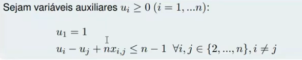

# dotnet-caixeiro-viajante-TSP

- Implementação para resolver o problema do caixeiro viajante para N pontos utilizando-se a biblioteca `Gurobi`.
- Para realizar a otimização do problema utiliza-se as regras de restrição baseadas no algoritmo de `Miller-Tucker-Zemlin (MTZ)`.

## Domínio

- Um percurso com vários pontos que devem ser visitados pelo viajante
- Cada ponto de destino deve ser visitado uma única vez pelo viajante
- Cada ponto deve ter um único ponto de origem

## Objetivo

- Escolher a melhor rota de modo a otimizar os custos diminuindo a distância total percorrida

## Dependências

- [Guropi Optimization](https://www.gurobi.com/)
- [.Net](https://dotnet.microsoft.com/download)

## Licença Guropi

- Para utilizar a dll, é necessário realizar cadastro no site [Guropi](https://www.gurobi.com/account/)
- Realizar o download e instalação do programa [Gurobi Optimizer](https://www.gurobi.com/downloads/gurobi-software/)
- Solicitar uma [licença acadêmica](https://www.gurobi.com/downloads/end-user-license-agreement-academic/) (necessário uma conta de email universitária)
- Com a licença criada em [Guropi](https://www.gurobi.com/downloads/licenses/) ir em detalhes, pegar o id da chave e executar o comando no terminal (com a sua respectiva chave)
  - `grbgetkey xx-xx-xx-xx-xx`
- Executar o programa `Gurobi Token Server`
- Baixar e rodar imagem [Docker](https://hub.docker.com/r/gurobi/optimizer) do Guropi
  - `docker pull gurobi/optimizer`
- Criar projeto dotnet e adicionar o pacote via [Nuget](https://www.nuget.org/packages/OPTANO.Modeling.Gurobi/)
    `dotnet add package OPTANO.Modeling.Gurobi --version 9.1.2.26`

## Limitações

- Na resolução do problema obtem-se muitas subrotas que entram em conflito com as restrições do domínio, como a não repetição de pontos e que todos eles sejam visitados, então adiciona-se restrições dessas sub-rotas ao modelo manualmente.
- Como limitante há um crescimento exponencial no número de restrições conforme aumenta-se o número de pontos e por consequência o consumo de recurso computacional.
- O algoritmo `MTZ` dispensa a adição manual das restrições de subrotas e ainda reduz consideravelmente o custo computacional para as equações, sem ele uma rota de 20 pontos teria 1.048.554 combinações de restrições e com ele 342 restrições, consumo de 0,032% do método tradicional.
  
## Restrições de Miller-Tucker-Zemlin(MTZ)

- O algoritmo `MTZ` mesmo removendo sub-rotas esta solução ainda continuará sujeita ao limite de recurso computacional do hospedeiro.

## Próximos passos

- Implementar outra estratégia como solução para o TSP sem `MTZ`, que em tempo de execução identifica existência de subrotas e adiciona-as dinâmicamente como restrição do modelo antes de gerar a solução.
- Verificar exemplos de implementação no site do `Gurobi`

  model.SetCallback(new tsp_cs(vars));
  model.Optimize();

## Referência

Material obtido do Pr. Dr. Gustavo Valentim Loch da UFPR.

- [Youtube Pesquisa Operacional](https://youtu.be/7MDnRH97--o) Parte 1 - 00:25:04 hrs duração (Acessado em Set 2021)
- [Youtube Pesquisa Operacional](https://youtu.be/VK1XOad0aa8) Parte 2 - 00:31:20 hrs duração (Acessado em Set 2021)
- [Youtube Pesquisa Operacional](https://youtu.be/ExGhV4ruxoE) Parte 3 - 00:27:26 hrs duração (Acessado em Set 2021)
- [Youtube Pesquisa Operacional](https://youtu.be/wqPti8ptR3I) Parte 4 - 01:13:00 hrs duração (Acessado em Set 2021)
- [Youtube Pesquisa Operacional](https://youtu.be/mQ5TFXXrMtc) Restrições de Miller-Tucker-Zemlin (MTZ) - 01:27:58 hrs duração (Acessado em Set 2021)

